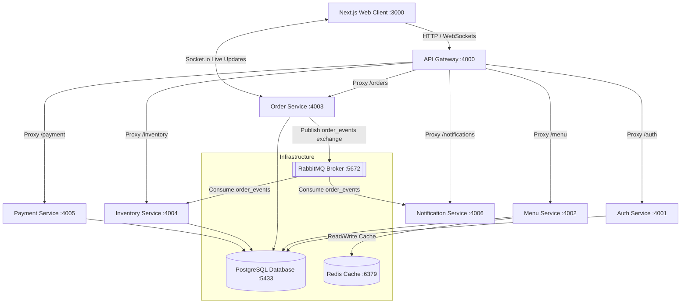

# 🇮🇳 ServeSmart: CRPF Canteen Management System

ServeSmart is a real-time, microservices-based canteen management application specifically tailored to streamline food services and inventory workflows for CRPF (Central Reserve Police Force) personnel. In traditional canteen operations, high volumes of orders during peak hours trigger major bottlenecks, leading to long queues, error-prone manual ledger records, slow order status tracking, and delayed inventory restock warnings. ServeSmart digitalizes the entire process: soldiers can log in via a dedicated portal, place orders, generate secure QR codes for simulated UPI payments, and watch their order fulfillment status update live via WebSockets. Concurrently, kitchen staff receive instant updates on a live KDS (Kitchen Display System) dashboard, while the event-driven inventory service tracks consumption in the background to automatically update stock quantities and alert administrators of low-stock thresholds.

---

## 🛠️ Tech Stack

This project uses a modern JavaScript/TypeScript codebase designed for scalability and asynchronous events. Below are the *only* technologies, frameworks, and library modules actually imported and utilized in the codebase:

### 💻 Frontend (Web App)
- **Framework:** Next.js (React 19, TypeScript)
- **Styling:** TailwindCSS v4
- **Data Visualization:** Recharts (for admin analytics and reports)
- **Utilities:**
  - `qrcode.react` (Generates UPI dynamic QR codes per order)
  - `socket.io-client` (Connects to the Order Service for real-time state synchronization)

### 🛰️ API Gateway
- **Platform:** Node.js + Express
- **Middleware / Libraries:**
  - `http-proxy-middleware` (Routes HTTP requests to corresponding backend microservices)
  - `helmet` (Provides HTTP security headers)
  - `express-rate-limit` (Prevents brute-force requests and rate limits API endpoints)
  - `jsonwebtoken` (Validates soldier/staff JWT access tokens at the entry boundary)
  - `morgan` (Standardizes HTTP request logging)
  - `cors` (Configures Cross-Origin Resource Sharing)

### ⚙️ Backend Microservices
- **Platform:** Node.js + Express (all services)
- **Database Client:** `pg` (PostgreSQL client utilized in Auth, Menu, Order, Inventory, and Payment services)
- **Message Broker Client:** `amqplib` (RabbitMQ broker connection library in Order, Inventory, and Notification services)
- **Cache Client:** `ioredis` (Redis client used by Menu Service to cache menus)
- **Real-time Server:** `socket.io` (Runs alongside Order Service to broadcast live updates to clients)
- **Security Utilities:**
  - `bcryptjs` (Handles password hashing in Auth Service)
  - `jsonwebtoken` (Signs JWT access and refresh tokens in Auth Service)
- **SMS Client Integration:** `twilio` (Imported in Auth Service for potential administrative verification; current logic logs SMS OTP details locally)

### 🐳 Infrastructure & Dev-Ops
- **Database Engine:** PostgreSQL (v15-alpine)
- **Caching Layer:** Redis (v7-alpine)
- **Message Queue Broker:** RabbitMQ (v3-management-alpine)
- **Application Monitoring:** Prometheus (metrics scraping) & Grafana (dashboards representation)

---

## 🏗️ Architecture & Service Boundaries

ServeSmart is divided into 6 modular microservices and 1 API gateway, coordinated through synchronous REST calls and asynchronous RabbitMQ event messages.



### 🛰️ API Gateway (`:4000`)
Acts as the reverse proxy. Public paths (`/api/v1/auth`, `/api/v1/menu`) are passed through. Protected paths check for a JWT and insert the user details (role and ID) into the request headers (`x-user-id`) before proxying them to internal backend services.

### 🔐 Auth Service (`:4001`)
Handles soldier signup, password hashing via `bcryptjs`, and issuing token keypairs. In addition, it supports an administrative registration loop utilizing a mock SMS OTP verification.

### 🍽️ Menu Service (`:4002`)
Manages food menu lists and categories. It attempts to load active menu items from Redis; if not found, it pulls from PostgreSQL and populates Redis.

### 🛒 Order Service (`:4003`)
Accepts order creation and status modifications. It maintains a Socket.io server to emit realtime progress updates directly to the client. When an order status transitions (e.g. `Pending` -> `Accepted` -> `Ready`), it publishes an event payload to RabbitMQ on the `order_events` fanout exchange.

### 📦 Inventory Service (`:4004`)
Listens to `order_events` from RabbitMQ. Upon detecting a newly accepted order, it automatically decrements the respective food items' stock and sends notifications if thresholds fall below configured warning limits.

### 💳 Payment Service (`:4005`)
Generates transaction signatures and UPI URLs (pre-populated with canteen merchant details and item totals). When the client reports payment confirmation, this service inserts a success transaction record and triggers order transition to `Accepted` in PostgreSQL.

### 📢 Notification Service (`:4006`)
Listens to RabbitMQ event messages to log and dispatch mock push alerts about order status changes.

---

## ⚡ Setup & Installation

Follow these steps to set up ServeSmart on your local machine.

### 1️⃣ Clone the Repository and Install Root Workspace Dependencies
First, clone the project and navigate into the `crpf` directory:
```bash
git clone https://github.com/Shravan3024/crpf-canteenpro.git
cd crpf-canteenpro/crpf
npm install
```

### 2️⃣ Initialize Database and Middleware Infrastructure
Make sure Docker Desktop is running. Start the supporting database, cache, message queue, and monitoring dashboard containers:
```bash
docker-compose up -d
```
*Note: This automatically provisions PostgreSQL on host port `5433`, Redis on port `6379`, RabbitMQ on port `5672`/`15672`, and initializes the schema structure using the `./docs/schema.sql` template.*

### 3️⃣ Configure Environment Variables
Create `.env` files inside each service folder based on the variables they reference. Below are the actual variables needed:

#### API Gateway (`apps/api-gateway/.env`)
```env
PORT=4000
JWT_SECRET=<YOUR_JWT_SECRET_KEY>
CORS_ORIGIN=http://localhost:3000
AUTH_SERVICE_URL=http://localhost:4001
MENU_SERVICE_URL=http://localhost:4002
ORDER_SERVICE_URL=http://localhost:4003
INVENTORY_SERVICE_URL=http://localhost:4004
PAYMENT_SERVICE_URL=http://localhost:4005
NOTIFICATION_SERVICE_URL=http://localhost:4006
```

#### Auth Service (`services/auth-service/.env`)
```env
PORT=4001
JWT_SECRET=<YOUR_JWT_SECRET_KEY>
JWT_REFRESH_SECRET=<YOUR_JWT_REFRESH_SECRET_KEY>
DB_HOST=localhost
DB_PORT=5433
DB_USER=<YOUR_DB_USER>
DB_PASSWORD=<YOUR_DB_PASSWORD>
DB_NAME=servesmart
```

#### Menu Service (`services/menu-service/.env`)
```env
PORT=4002
DB_HOST=localhost
DB_PORT=5433
DB_USER=<YOUR_DB_USER>
DB_PASSWORD=<YOUR_DB_PASSWORD>
DB_NAME=servesmart
REDIS_HOST=localhost
```

#### Order Service (`services/order-service/.env`)
```env
PORT=4003
QR_SECRET=<YOUR_QR_SIGNING_SECRET>
DB_HOST=localhost
DB_PORT=5433
DB_USER=<YOUR_DB_USER>
DB_PASSWORD=<YOUR_DB_PASSWORD>
DB_NAME=servesmart
RABBITMQ_URL=amqp://<MQ_USER>:<MQ_PASSWORD>@localhost:5672
```

#### Inventory Service (`services/inventory-service/.env`)
```env
PORT=4004
DB_HOST=localhost
DB_PORT=5433
DB_USER=<YOUR_DB_USER>
DB_PASSWORD=<YOUR_DB_PASSWORD>
DB_NAME=servesmart
RABBITMQ_URL=amqp://<MQ_USER>:<MQ_PASSWORD>@localhost:5672
```

#### Payment Service (`services/payment-service/.env`)
```env
PORT=4005
QR_SECRET=<YOUR_QR_SIGNING_SECRET>
DB_HOST=localhost
DB_PORT=5433
DB_USER=<YOUR_DB_USER>
DB_PASSWORD=<YOUR_DB_PASSWORD>
DB_NAME=servesmart
```

#### Notification Service (`services/notification-service/.env`)
```env
PORT=4006
RABBITMQ_URL=amqp://<MQ_USER>:<MQ_PASSWORD>@localhost:5672
```

#### Web App Frontend (`apps/web/.env.local`)
```env
NEXT_PUBLIC_API_URL=http://localhost:4000/api/v1
```

---

## 🗄️ Database Seeding & Mock Account Activation

Because the database starts blank, you must run the menu and order seeders, and register the default testing roles:

### 1. Register Default Test Accounts
Since the system enforces strict Role-Based Access Control (RBAC), you can create the initial test users using the registration endpoints through the API Gateway, or call a POST request manually:
- **Soldier User Registration:** Submit a `POST` request to `http://localhost:4000/api/v1/auth/signup` with:
  ```json
  {
    "username": "091234567",
    "email": "soldier@crpf.gov.in",
    "password": "soldier123",
    "role": "soldier"
  }
  ```
- **Kitchen User Registration:** Submit a `POST` request to `http://localhost:4000/api/v1/auth/signup` with:
  ```json
  {
    "username": "kitchen1",
    "email": "kitchen@crpf.gov.in",
    "password": "kitchen123",
    "role": "kitchen"
  }
  ```
- **Admin User Registration:** Register via OTP confirmation (or use signup with `role: "admin"` for developer testing).

*Alternative:* Run the password reset script in the root directory if the database is already pre-populated:
```bash
node scripts/reset-passwords.js
```

### 2. Seed Canteen Categories & Menu Items
Run the menu seeding script to create categories (Meals, Snacks, Beverages, etc.) and mock menu records (Butter Chicken Thali, Paneer Tikka Roll, Masala Chai, etc.):
```bash
node services/menu-service/seed.js
```

### 3. Seed Fake Historical Orders (For Admin Analytics Charts)
To populate the Recharts graphs in the Admin Portal with analytical charts, run:
```bash
node scripts/seed-orders.js
```

---

## 🏃 Run the Application

Start all backend services, the gateway, and the frontend server concurrently using the root package commands:

```bash
# Start all microservices and the API gateway
npm run start:services

# In a separate terminal, start the Next.js web application
npm run dev

# OR, run both services and frontend together:
npm run start:all
```
Open [http://localhost:3000](http://localhost:3000) to access the ServeSmart Portal.
